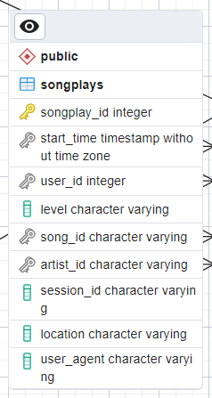
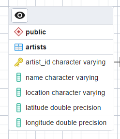
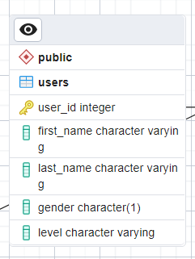

# Sparkify ETL

## Table of contents
- [Sparkify ETL](#sparkify-etl)
  - [Table of contents](#table-of-contents)
  - [Introduction](#introduction)
  - [Tools](#tools)
  - [Usage](#usage)
  - [Database Schema Design](#database-schema-design)
    - [Facts](#facts)
      - [Songplays fact](#songplays-fact)
    - [Dimensions](#dimensions)
      - [Time dimension](#time-dimension)
      - [Songs dimension](#songs-dimension)
      - [Artists dimension](#artists-dimension)
      - [Users diemension](#users-diemension)
  - [Sparkify Project Files](#sparkify-project-files)
    - [_`sql_queries.py`_](#sql_queriespy)
    - [_`create_tables.py`_](#create_tablespy)
    - [_`etl.py`_](#etlpy)
    - [_`etl.ipynb`_](#etlipynb)
    - [_`test.ipynb`_](#testipynb)
    - [_data folder_](#data-folder)
  - [Future work](#future-work)

## Introduction

A startup called **Sparkify** wants to analyze the data they've been collecting on songs and user activity on their new music streaming app. 

The analytics team is particularly interested in understanding what songs users are listening to.

We can extract the following data and more
 
* The most played music in the entire app
* The top 5 artists in the app according to their songs
* The most day of the week people listen to songs 
* and more....

The ETL extracts the data from songs and log files into a single database as read-only database which runs with the star schema model for analysis.

The database management system used in the ETL is **postgres** which is realtional (SQL) database 
## Tools

## Usage

* To run the ETL, you have to create the database and the tables so we have to execute `create_tables.py` file.

* Now we can run `etl.py` to transfer our data from songs and log files into the database tables.

**_Important_**: _update the database and account credentials in the files to your own credentials_

**Congrats you executed your ETL successfully**

## Database Schema Design 

Sparkify Schema is a star schema built for analysis and we can update it only with the ETL but users can not edit it.

Star Schema consists of facts and dimensions 

### Facts

#### Songplays fact  
- Records in log data associated with song plays 
- Records with page NextSong

Members:-

* `songplay_id` 
* `start_time`
* `user_id`
* `level`
* `song_id` 
* `artist_id` 
* `session_id`
* `location`
* `user_agent`

**Fact table contains the business event of the analysis which is listening to a song transactions**

_Fact table contains foreign keys for the dimensions around it._

### Dimensions

**Dimensions is the business entities around the business event**

We have 4 dimensions which is `songs`, `artists`, `users`, `time`

#### Time dimension

* timestamps of records in songplays broken down into specific units

Members:-

* `start_time`
* `hour` 
* `day` 
* `week` 
* `month` 
* `year` 
* `weekday`

The Time dimension helps us to make the data consistant in the schema and remove redunduncies.

#### Songs dimension

* Songs in music database

Members:-

* `song_id`
* `title` 
* `artist_id` 
* `year` 
* `duration`

#### Artists dimension

* Artists in music database

Members:-

* `artist_id`
* `name`
* `location` 
* `latitude`
* `longitude`

#### Users diemension

* Users in the app

Members:-

* `user_id`
* `first_name`
* `last_name`
* `gender`
* `level`

## Sparkify Project Files

### _`sql_queries.py`_ 

The file contains all create, drop, insert and select queries which the `create_tables.py` executes to create the database schema and integrates the data.

### _`create_tables.py`_

We have 3 functions in this python file and main function which executes the functions

* _create_database()_

  - Creates and connects to the sparkifydb
  - Returns the connection and cursor to sparkifydb

* _drop_tables(cur, conn)_
  - Drops each table using the queries in `drop_table_queries` list in sql_queries.py

* _create_tables(cur, conn)_
  - Creates each table using the queries in create_table_queries` list in sql_queries.py 

### _`etl.py`_
The file processes all the files and runs the inserts to insert data into the fact and dimensions and it consists of 3 functions

* _process_song_file(cur, filepath)_
  
  * reads the song files from its path
  * inserts the songs data and artists data to songs and artists dimensions

* _process_log_file(cur, filepath)_

  * reads the log files data from its path filtred by NextSong page
  * inserts the time records from the log files into time dimension
  * inserts the user records from the log files into users dimensions
  * inserts the transactions which is the songs listening to songplays fact 

* process_data(cur, conn, filepath, func)

  * Get all the files with `.json` extension which are the songs files and log files

### _`etl.ipynb`_

This jupyter notebook file used for development to get the data from the first file only and ensure that the data is valid for insertion

### _`test.ipynb`_

This file contains test queries and sanity tests for checking database schema and it's quality
The file used _**sql magic**_ to execute their queries

### _data folder_
Contains log files in json and songs files and every file of songs files contains one song data

## Future work

Create a dashboard for analytic queries on sparkify database in Microsoft Power BI

